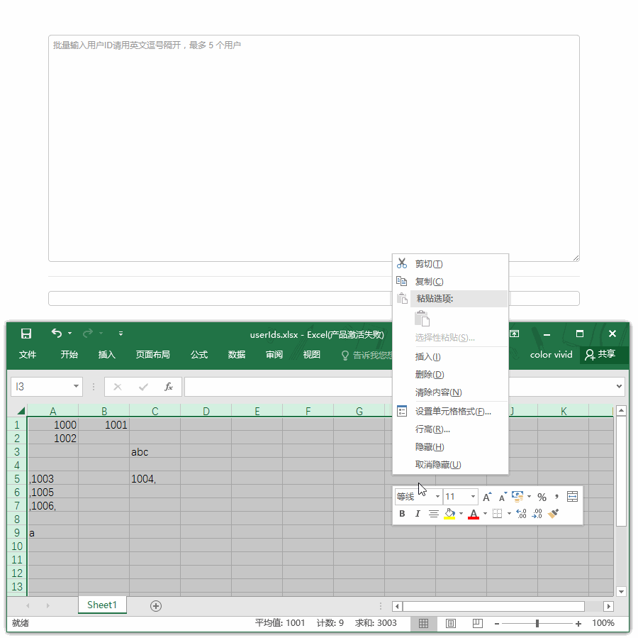

# ct-adc-user-id-textarea

将从 Excel 表格中复制的用户 ID，格式化成逗号分隔的字符串（textarea）

## Table of contents

- [Demo build setup](#demo-build-setup)
- [Live Demo](#live-demo)
- [What's included](#whats-included)
- [Quick start](#quick-start)
- [Bugs and feature requests](#bugs-and-feature-requests)
- [Thought](#thought)
- [License](#license)

## Demo build setup

``` bash
# install dependencies
npm install
or
cnpm install

# serve with hot reload at localhost:8080
npm run dev

# build for production with minification
npm run build

# build for production and view the bundle analyzer report
npm run build --report
```

For detailed explanation on how things work, checkout the [guide](http://vuejs-templates.github.io/webpack/) and [docs for vue-loader](http://vuejs.github.io/vue-loader).

## Live demo

Just click there: [Live Demo](http://htmlpreview.github.io/?https://github.com/ct-adc/ct-adc-user-id-textarea/blob/master/view/demo.html).



## What's included

Within the download you'll find the following directories and files, logically grouping common assets and providing both compiled and minified variations. You'll see something like this:

```
ct-adc-pattern-input/
├── ...
├── src/
│   ├── /component
│   │   └── ct-adc-user-id-textarea.vue
│   └── /js
│      └── ... demo ...
└── /view
    └── demo.html
```

## Quick start

#### Parameter declaration

```javascript
/**
 * Component Settings
 * @param  {String} separator    用户 ID 之间的分隔符
 * @param  {String} userId       用户 ID
 */
```

#### Vue script

组件配置项

```javascript
setting: {
  separator: ', ', // 逗号加空格
  userId: '123,223' // 初始值
}
```

#### Vue template

组件使用

```html
<user-id-textarea class="form-control"
                  :placeholder="'批量输入用户ID请用英文逗号隔开，最多 ' + max + ' 个用户'" rows="18"
                  :separator="setting.separator"
                  :userId="setting.userId"
                  @change="updateUserId"></user-id-textarea>
```

> 可以想原生组件一样使用 class、rows 等等

## Bugs and feature requests

Have a bug or a feature request? If your problem or idea is not addressed yet, [please open a new issue](https://github.com/ct-adc/ct-adc-user-id-textarea/issues/new).

## Thought

第一版先这样吧

## License

Code released under the [MIT License](https://github.com/ct-adc/ct-adc-user-id-textarea/blob/master/LICENSE).